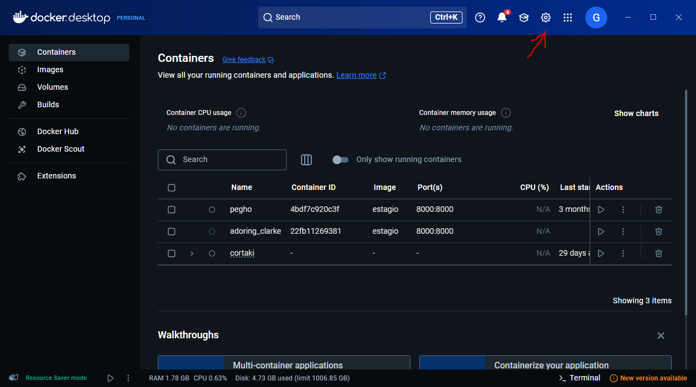
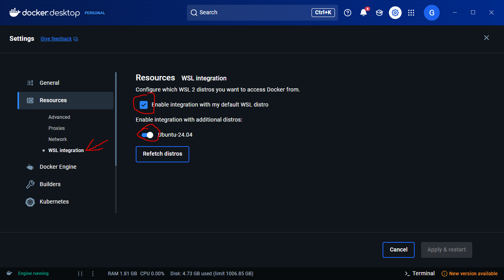

# Instalando o Docker

## 📌 Passo 1: Verificar os Requisitos

Antes de instalar o Docker, verifique se seu sistema atende aos requisitos:
- **WSL 2** ativado
- **Versão do Windows 10**: Build 1903 ou superior
- **Virtualização ativada** (verifique na BIOS)

Para confirmar a versão do WSL, execute:
```bash
wsl --list --verbose
```
O WSL 2 deve estar listado.

---
Dúvidas sobre como ativar a virtualização? Consulte: [INSTAL_WSL](INSTAL_WSL.md) - Passo 1.

## 📌 Passo 2: Atualizar os Pacotes do Sistema

1. Abra o **terminal** no WSL.
2. Atualize a lista de pacotes do sistema:

```bash
sudo apt update && sudo apt upgrade -y
```

## 📌 Passo 3: Instalar o Docker com Docker Desktop

### Instalar o Docker Desktop

1. Baixe e instale o [Docker Desktop](https://www.docker.com/products/docker-desktop/).
   

2. Após a instalação, abra as configurações do Docker Desktop.
   

3. **Habilite** a integração com o WSL.
   

4. Após isso, **reinicie o computador**.

---

## 📌 Passo 4: Testar a Instalação

Para testar se o Docker está funcionando corretamente, execute:

```bash
docker run hello-world
```

Se aparecer uma mensagem de sucesso, o Docker foi instalado corretamente! 

Agora, seu WSL está pronto para rodar contêineres Docker!
